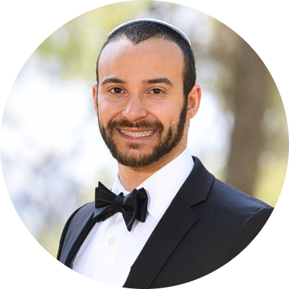

# Daniel Klein

#### _Software Engineer_

## Personal Information

 
 
 
 
![+1 917 727 6003](https://img.shields.io/badge/-+1_917_727_60036-2196f3?style=for-the-badge&logo=data:image/png;base64,iVBORw0KGgoAAAANSUhEUgAAACAAAAAgEAQAAACJ4248AAAABGdBTUEAALGPC/xhBQAAACBjSFJNAAB6JgAAgIQAAPoAAACA6AAAdTAAAOpgAAA6mAAAF3CculE8AAAAAmJLR0QAAKqNIzIAAAAJcEhZcwAAAGAAAABgAPBrQs8AAAAHdElNRQflBggNMy7gzAZyAAAB8ElEQVRYw8WWQSt8YRTGz/ufNFdjbNgwS6Nb1pSkmVj4ABTlC1iLhG+hLFDyIQyzsfIBxBQlTQkbVqapuTben8WNUe69c/y773jWz/s+v/uee05HoFCAkxMIAiIVBNjTUygUxIXCyzWqVt0A0GrpAN7eIJNJO/+fYK3Oms0KAwPpA5hmU+02g4PpA0ijobcPDTkAqNf19qmp9AG4vVW7KZXSBzDX12q3mZwEY1J+gfNzvT2TEUkXQERE4PFRNwt2dlIPFxHBHhx0zLYXF+B5jgBKpeT0ZhN830l4WAJjsPV6PMDysrPwNsTaWnR4reY8PATI5eDlJRpifr5LEFtb0QAPD9i+vi4AeB7c3UV3weFhd17Bzs3Ft+L6epcg4ubC+zssLbkHoLcXrq7iITY2ks/u7oY75usrVKuwvQ3lMvg+2qUGOzoa3xUAR0fYfP7nmcvLjlOVVgsqFRge7gAxMRFOwTg9PcHCQvjli4vQaHQO/65KRVGO2dlkCIBa7XfBnwoCZTnGx+H5+f9CkqX/MW2xqKuvI4CwHJ4H+/t/BtAGmZmBm5s/AwhLks3C5mZyqzoEaL9GLgerq8n7RJyUXaADMQY7PQ17e3B/rwM4Pk5/w/0CGhkRKZeFsTExvi8Ui2L6+0XyeZGeHpGzM5GVlQ+j3CR8u7YD9gAAACV0RVh0ZGF0ZTpjcmVhdGUAMjAyMS0wNi0wOFQxMzo1MTo0NiswMDowMKyx52oAAAAldEVYdGRhdGU6bW9kaWZ5ADIwMjEtMDYtMDhUMTM6NTE6NDYrMDA6MDDd7F/WAAAAAElFTkSuQmCC&labelColor=0069c0&logoColor=white) 
![+972 58 525 5247](https://img.shields.io/badge/-+972_58_525_5247-2196f3?style=for-the-badge&logo=data:image/png;base64,iVBORw0KGgoAAAANSUhEUgAAACAAAAAgEAQAAACJ4248AAAABGdBTUEAALGPC/xhBQAAACBjSFJNAAB6JgAAgIQAAPoAAACA6AAAdTAAAOpgAAA6mAAAF3CculE8AAAAAmJLR0QAAKqNIzIAAAAJcEhZcwAAAGAAAABgAPBrQs8AAAAHdElNRQflBggNMy7gzAZyAAAB8ElEQVRYw8WWQSt8YRTGz/ufNFdjbNgwS6Nb1pSkmVj4ABTlC1iLhG+hLFDyIQyzsfIBxBQlTQkbVqapuTben8WNUe69c/y773jWz/s+v/uee05HoFCAkxMIAiIVBNjTUygUxIXCyzWqVt0A0GrpAN7eIJNJO/+fYK3Oms0KAwPpA5hmU+02g4PpA0ijobcPDTkAqNf19qmp9AG4vVW7KZXSBzDX12q3mZwEY1J+gfNzvT2TEUkXQERE4PFRNwt2dlIPFxHBHhx0zLYXF+B5jgBKpeT0ZhN830l4WAJjsPV6PMDysrPwNsTaWnR4reY8PATI5eDlJRpifr5LEFtb0QAPD9i+vi4AeB7c3UV3weFhd17Bzs3Ft+L6epcg4ubC+zssLbkHoLcXrq7iITY2ks/u7oY75usrVKuwvQ3lMvg+2qUGOzoa3xUAR0fYfP7nmcvLjlOVVgsqFRge7gAxMRFOwTg9PcHCQvjli4vQaHQO/65KRVGO2dlkCIBa7XfBnwoCZTnGx+H5+f9CkqX/MW2xqKuvI4CwHJ4H+/t/BtAGmZmBm5s/AwhLks3C5mZyqzoEaL9GLgerq8n7RJyUXaADMQY7PQ17e3B/rwM4Pk5/w/0CGhkRKZeFsTExvi8Ui2L6+0XyeZGeHpGzM5GVlQ+j3CR8u7YD9gAAACV0RVh0ZGF0ZTpjcmVhdGUAMjAyMS0wNi0wOFQxMzo1MTo0NiswMDowMKyx52oAAAAldEVYdGRhdGU6bW9kaWZ5ADIwMjEtMDYtMDhUMTM6NTE6NDYrMDA6MDDd7F/WAAAAAElFTkSuQmCC&labelColor=0069c0&logoColor=white)

## About Me

Skilled software engineer offering 2 years of programming experience. As a goal-oriented quick learner with strong attention to detail, I work well in a team.

## Skills

### Programming Languages

 
 
 
 
 
 
![SQL - _Intermediate_](https://img.shields.io/badge/SQL-Intermediate-DE8C02?style=for-the-badge&logo=data:image/png;base64,iVBORw0KGgoAAAANSUhEUgAAACAAAAAgEAQAAACJ4248AAAABGdBTUEAALGPC/xhBQAAACBjSFJNAAB6JgAAgIQAAPoAAACA6AAAdTAAAOpgAAA6mAAAF3CculE8AAAAAmJLR0QAAKqNIzIAAAAJcEhZcwAAAGAAAABgAPBrQs8AAAAHdElNRQflBggPLDI6E4DNAAADcUlEQVRYw82XTWtTWxSGn5U2qTQFW7XGpBUFvzqw0WoHRpxocaa/QIoDBaF/QAQLrY6cOHZiBqI40j+hYCP4QaQYv0DRNK0EGsHGpNL9OjjkniSNjb1p7vWdnbPPWe9aa6/9rrWNJpD27IFjx9DICLZ/P9q5E4vFIBiE3l7vq0IBfv5Ec3PY58/o7Vvs+XNIpcw+fGjG0YA0FpOuX5cyGbUK9/q1dO2aFIs1J3bBoDQ9LZXLLROvQrksTU/LBYNrRJ5MbjxxPZLJak7zo49EsFwOzGgrJIjFzObnAQL+wvbt7ScHMEORSOUp0IqpjcBf5IA599/RNuDyjmA+3/5TkM/LhUIN/ZJOnZIKhfaRLy5KJ0/+hnzLFqmjQ25w0NODUmnjiEsludu3pYEBqaND2rq1wRYMD0tXrvjP/f1yFy9KDx9K2ez6SbNZuQcPpAsX5Pr7fbtXr8oND/9TetUOYOk03LkDly9XhMLPUDSK9u6FXbtgxw6suxu6u73VYhEVizA/D58+Ye/fm+Vyq/7nxg0YH0eHDlkgnW6QgaqU6e5duTNnpHD439a6FA7LnT0r3btXs6UuHl8jA/VYXkbpNLx4gWUyMDcHuRx8/w6lkvfNpk3Q0wOxGESjaGgIRkaweBwaVHxVBjqbxxEKYaOjMDr6x6GvQ9D/JyX0e46/BQqHIZ/30tlOlEqwbZvZ0lJNBrwXExOwstI+8pUVmJiokNegIo9SIiGlUhsugm5mRkokqrnqHIjHq2VSSiTkbt5sbS7MZDwbHrHHc/q03MGDq2vAxePY48dw6ZLZ/fs1zqmvDx09iu3b503F0SgKhz0xAlQsYktL3hH98gW9e4c9e2a2uOjbMEPnzsGtW5BIWODVqwYZqCCVkhsfb0WEfLs9PdL589LTp/52rCnF1VheRo8eYU+ewMuXkMlANmtWKDQkU28vDAzA0BAcPoyOH8dOnFglRn8uRKEQNjYGY2O1RMUilMvw7Zv3ZvNm6Orye0N9eL9HlQPrGUgrjaivr9UtqlLChQVvZG43JOzr11UOWGBhAWovDe1BMlnf6n3fXGenNDm5sdNQBT9+SJOTcp3NG6BcJCJNTUmzs60Tz85KU1Ny/mWkGk0LT9q927ueHzmCHTgAg4Ne3+/q8qofvNNQLvtC9OaNdz2fmTH7+HEt+78AvR8quAjiq3YAAAAldEVYdGRhdGU6Y3JlYXRlADIwMjEtMDYtMDhUMTU6NDQ6NTArMDA6MDCEiRmXAAAAJXRFWHRkYXRlOm1vZGlmeQAyMDIxLTA2LTA4VDE1OjQ0OjUwKzAwOjAw9dShKwAAAABJRU5ErkJggg==&labelColor=005E88&logoColor=white) 
 
 

### UI Design

 
 
 
 

### Database Systems

 
 

### Other

 
 
 
 
 

## Professional Experience

### ![Junior Software Developer](https://img.shields.io/badge/-Web_Developer-FE4648?style=for-the-badge&labelColor=FECCCD&logo=data:image/png;base64,iVBORw0KGgoAAAANSUhEUgAAACAAAAAgEAYAAAAj6qa3AAAABGdBTUEAALGPC/xhBQAAACBjSFJNAAB6JgAAgIQAAPoAAACA6AAAdTAAAOpgAAA6mAAAF3CculE8AAAABmJLR0QAAAAAAAD5Q7t/AAAACXBIWXMAAABgAAAAYADwa0LPAAAAB3RJTUUH5QYKEjkSiD++uQAABbRJREFUaN7tmHtMFFcUxr8zu0vBF9SqKEYKlIhQBIrYajVR3rBu1UKJgYhVibtNqyaV4DM+wNJoiDVVTIQGjOIWqkgVlMcqKmmVBlhNkLZo8AFqwIoIu1oQdub0D2UlEitYhDTZ3z+TzNzc833f3DmZewELFixYsGBh0GEOPRZ6bMKE7utQ6aA3bzQqKipKJgMbfA2+/v68lefQebUam1CPlQsXQsYe7CqTQQtQ0dmztATxKElPB1pa7t8/fpwE/SX9pa6u/00AzGF+YX5ubuwofs2Ry5ahnJ6QaulSOCAHCfb2fZ6oGQ8xrqUFX+BtTs3NpVxhNKn37SOhOKc4p7p6yANgnnE7KsrGBjxymdGgUvEh7EKoWo3FdBpCYCAE6FBMA7/CzgHYptdTAACkp4Ott1iZsrNJyJ+dP9tofGMBMIeEhIRMm8aRAOWq1cjkFJiiozGKEihm5MgBN9pX2uGHoI4O7IAKpwsKKJHKeG56OqhkQ8mG0tKnr4C5zwEwK48oj4wfD3R9K9YsWsTl9A1Wx8VhBvbQ4qlTh8xof6lGEuddu8be/BFssrMF5iAxKDOThDOlZ0obGswBMAf7hGmVSt5FeTiq0WAVEjFBqYQCjbgplw+1jwGjCxPgbDJhL7aisbCQ4jkCUWlpcnDnZblbRQXFWy3vWuvszKewhg6OHQsAeBdAHQVgx4MH+BIKfBAeDjm8MEUmG2o/fUZCCMKYcZqD8WdlJcVjO6/V6cCdlxVWFRUv7QEshcWHxU+fzpCu4PeKCszn2cjcvx9NWMCnOjqwn37B+6Gh8EU+Jbm7D7VPM8+WPnnTZ4KXVgsI1oBWS1RUV1R3/fqLw1+6xHmRuITfWrECP1ECAaB8LsMhrRYk/Mpn29t5ON4R8h89wmlOgWn+fMykBMi9vAbNaDmnwFRdjWDaAZv8fHqMB9KT48fJRzdDN0yv7+s0Qi/jUlBgUKCtLTJoI/0VE/P8CX0nhre2glkpjHZ3p8dszRuammgm6aUYlYogHyEMc3IiArBNo8Ee6JF98iSecBb/3NnZb4MmVKNWFJEPf9514QIRiqhu/XoioQXNU6aY6z7T0a2rv2V6BQASghT1kZEYgS7cGT68RzRreI3BwO5YyZu8vZnpLiWlpjKQIxxpaGB9V5xUUVjIjvw5n3NxodWSD9J27iRrKcGkcXAgsBJ2sbHYim3go0dh4BT+0Wg0X5/d7x5HCpKzadw4WkD38INGY1ZxQorkgxkZLKFFMNTXm3U809XfAHp9ApzMCo6dNw8bCSh/8Wlb20tnmkbfw9PDA/UAlXl4MEgGrFuHOngqdjY0YB0K2bm4mHLZX/DNygJsjFZ/xMWBJGvJWhSR2LHZ5O/ry+/ScmaVCgWci8zNm+GFLRQxeTKAcHYFMB+g+H6vp1cHwNIcnsNyORtQzQ+DgwHoqByAyCm8W5Ign+U1a4rRCFwUf6vpR4X3cAbrHB2RCxDUagYlsKtajZaOr55waysAoB3AaEFG5+3sUI+D5s5cNnBGXxkAYD3JepKTE0axB3n2+LNro1toNhhoTKJ3IkmS5BZsCr0yAJVHYx8l29m9eYv/zvMeQKxkpVxubj7dNGA33WhqMg+rJRI+bW4eauEv8rq6zAEQ6dJ16bW1JOcS8YSDA5F4mOp8fcnHdszIgh7NhbnGdOzAAdxiLe7cuTPUxnETj/Dh7dtgmRuQmdnv4F63rvlAI0kKobl792ITpSErIuKN7QK76f6zS2YNYvPyaIug4/OrVhGVRJZENjYOWgC9A3l6DiBBrOTK6GjKQyulBgQglGr4Yz8/DMN22mRj0+cJ/8ZmTm5vRwl70sWqKv6EMiCWlgoKIQeHc3KIiquKq65e/a+6B+FECACIwOGu4a4TJ4JEF9HF3h7gFNlKW9seUhLE1LY2sOyG7Ma9e6CiuqK6u3dftZ21YMGCBQsWXp9/AMx1itFg8KCLAAAAJXRFWHRkYXRlOmNyZWF0ZQAyMDIxLTA2LTEwVDE4OjU3OjE4KzAwOjAwqgwJuwAAACV0RVh0ZGF0ZTptb2RpZnkAMjAyMS0wNi0xMFQxODo1NzoxOCswMDowMNtRsQcAAAAASUVORK5CYII=&logoColor=FE4648)

February _2022 - Present_

-   Responsible for the coding, design, and layout of the company’s website
### ![Web Developer](https://img.shields.io/badge/-Web_Developer-FE4648?style=for-the-badge&labelColor=FECCCD&logo=data:image/png;base64,iVBORw0KGgoAAAANSUhEUgAAACAAAAAgEAYAAAAj6qa3AAAABGdBTUEAALGPC/xhBQAAACBjSFJNAAB6JgAAgIQAAPoAAACA6AAAdTAAAOpgAAA6mAAAF3CculE8AAAABmJLR0QAAAAAAAD5Q7t/AAAACXBIWXMAAABgAAAAYADwa0LPAAAAB3RJTUUH5QYKEjkSiD++uQAABbRJREFUaN7tmHtMFFcUxr8zu0vBF9SqKEYKlIhQBIrYajVR3rBu1UKJgYhVibtNqyaV4DM+wNJoiDVVTIQGjOIWqkgVlMcqKmmVBlhNkLZo8AFqwIoIu1oQdub0D2UlEitYhDTZ3z+TzNzc833f3DmZewELFixYsGBh0GEOPRZ6bMKE7utQ6aA3bzQqKipKJgMbfA2+/v68lefQebUam1CPlQsXQsYe7CqTQQtQ0dmztATxKElPB1pa7t8/fpwE/SX9pa6u/00AzGF+YX5ubuwofs2Ry5ahnJ6QaulSOCAHCfb2fZ6oGQ8xrqUFX+BtTs3NpVxhNKn37SOhOKc4p7p6yANgnnE7KsrGBjxymdGgUvEh7EKoWo3FdBpCYCAE6FBMA7/CzgHYptdTAACkp4Ott1iZsrNJyJ+dP9tofGMBMIeEhIRMm8aRAOWq1cjkFJiiozGKEihm5MgBN9pX2uGHoI4O7IAKpwsKKJHKeG56OqhkQ8mG0tKnr4C5zwEwK48oj4wfD3R9K9YsWsTl9A1Wx8VhBvbQ4qlTh8xof6lGEuddu8be/BFssrMF5iAxKDOThDOlZ0obGswBMAf7hGmVSt5FeTiq0WAVEjFBqYQCjbgplw+1jwGjCxPgbDJhL7aisbCQ4jkCUWlpcnDnZblbRQXFWy3vWuvszKewhg6OHQsAeBdAHQVgx4MH+BIKfBAeDjm8MEUmG2o/fUZCCMKYcZqD8WdlJcVjO6/V6cCdlxVWFRUv7QEshcWHxU+fzpCu4PeKCszn2cjcvx9NWMCnOjqwn37B+6Gh8EU+Jbm7D7VPM8+WPnnTZ4KXVgsI1oBWS1RUV1R3/fqLw1+6xHmRuITfWrECP1ECAaB8LsMhrRYk/Mpn29t5ON4R8h89wmlOgWn+fMykBMi9vAbNaDmnwFRdjWDaAZv8fHqMB9KT48fJRzdDN0yv7+s0Qi/jUlBgUKCtLTJoI/0VE/P8CX0nhre2glkpjHZ3p8dszRuammgm6aUYlYogHyEMc3IiArBNo8Ee6JF98iSecBb/3NnZb4MmVKNWFJEPf9514QIRiqhu/XoioQXNU6aY6z7T0a2rv2V6BQASghT1kZEYgS7cGT68RzRreI3BwO5YyZu8vZnpLiWlpjKQIxxpaGB9V5xUUVjIjvw5n3NxodWSD9J27iRrKcGkcXAgsBJ2sbHYim3go0dh4BT+0Wg0X5/d7x5HCpKzadw4WkD38INGY1ZxQorkgxkZLKFFMNTXm3U809XfAHp9ApzMCo6dNw8bCSh/8Wlb20tnmkbfw9PDA/UAlXl4MEgGrFuHOngqdjY0YB0K2bm4mHLZX/DNygJsjFZ/xMWBJGvJWhSR2LHZ5O/ry+/ScmaVCgWci8zNm+GFLRQxeTKAcHYFMB+g+H6vp1cHwNIcnsNyORtQzQ+DgwHoqByAyCm8W5Ign+U1a4rRCFwUf6vpR4X3cAbrHB2RCxDUagYlsKtajZaOr55waysAoB3AaEFG5+3sUI+D5s5cNnBGXxkAYD3JepKTE0axB3n2+LNro1toNhhoTKJ3IkmS5BZsCr0yAJVHYx8l29m9eYv/zvMeQKxkpVxubj7dNGA33WhqMg+rJRI+bW4eauEv8rq6zAEQ6dJ16bW1JOcS8YSDA5F4mOp8fcnHdszIgh7NhbnGdOzAAdxiLe7cuTPUxnETj/Dh7dtgmRuQmdnv4F63rvlAI0kKobl792ITpSErIuKN7QK76f6zS2YNYvPyaIug4/OrVhGVRJZENjYOWgC9A3l6DiBBrOTK6GjKQyulBgQglGr4Yz8/DMN22mRj0+cJ/8ZmTm5vRwl70sWqKv6EMiCWlgoKIQeHc3KIiquKq65e/a+6B+FECACIwOGu4a4TJ4JEF9HF3h7gFNlKW9seUhLE1LY2sOyG7Ma9e6CiuqK6u3dftZ21YMGCBQsWXp9/AMx1itFg8KCLAAAAJXRFWHRkYXRlOmNyZWF0ZQAyMDIxLTA2LTEwVDE4OjU3OjE4KzAwOjAwqgwJuwAAACV0RVh0ZGF0ZTptb2RpZnkAMjAyMS0wNi0xMFQxODo1NzoxOCswMDowMNtRsQcAAAAASUVORK5CYII=&logoColor=FE4648)

April _2021 - January 2022_

-   Responsible for the coding, design, and layout of the company’s website

## Education

### ![Jerusalem College of Technology](https://img.shields.io/badge/-Jerusalem_College_of_Technology-FE4648?style=for-the-badge&labelColor=FECCCD&logo=data:image/png;base64,iVBORw0KGgoAAAANSUhEUgAAACAAAAAgCAYAAABzenr0AAAACXBIWXMAAAGGAAABhgHo4L8vAAAAGXRFWHRTb2Z0d2FyZQB3d3cuaW5rc2NhcGUub3Jnm+48GgAAAzZJREFUWIXll01oXFUYhp/3zCQk2opWhaIU1/5iKTY/ZJFoM5MYsxHirhZcVNHSRlGzaWitLaS4aMimuFAQ6Soui5MJpVaMP6E2/tRiK3QlVFCkajZmJnNeF8mUMSYzdyY1m77Le7/7Pi/fved858ItL/dmR90x1Lrh3I6hVvdmR4OlI948/5Oz/c8btCHwTP+gN89fsnREMdPninufSj6gfP67/wW8a+BBp0onMNnytZUBAKLNqaD4uqanf70p4Gx2S7QOCV4BUpX3VgtQfuwPKYxxx6YTmpwsNATu7k7T3PqC5WOYe1arCWs/rjttj/nP+e/d2/d03fBM/5NubpkzfnctOFTtwH9KTyvFsHK5q9XBmW3R4ZjE7kSuyQMAUDScDCmNKpf761/gwcHb4kLxTcEI0JLUsMorWFVNgv0u+bIz/Xt9+HAwyL19Q15Y/FFwqB54IwHK2hpxD+cubKF78O4ongVva8SokQBzSqknSLnYXNwXm4sHgv2V0qED+LJes3Qdtb/Lfpt0mHUpjoPawCdBtnSQxdK3chgm8IDt48DWJKZJOlA0TIimroh2uOQvluArpcctn7MZUkpPGd4CFtYb4IzU1B6ka6Z4fnlp1ZgXfsYlf43dosBOxGQjAa7IDAhN2MWPbI8Bm2qErVSrpBFHPhY6LbMLuLha4cpv4Lqk46gp51h4B5ypA7qa7rf9AfKsSL8E8RHjo8C95YJyB6LNh0qH9mjf51iYA9YLr5DaTOmzaHcpHboME8BiOcBZOewI0oxL8XPBflZMrJukILHbi6XZIF2TmtqAs2nJR+14CniIejblhrU05KCwR4R9gRivWMwAcSPwyzLSD6R19caScl/fE46MA53JXZY2IsHLydm6oOhhnZmagYplqKmp85qe6pJ5Dvg5uWFi/SL0ojrbdpbhsMam4kzm9kh4o9ZoTdiBNUf4mgEqglQ9XNQOUPsQk+gY7my2x9Y48FjCAJeFXtN0LlfLO9E4Vj7/iTrbt0vaA/xWpfS67GEV/n40CRwa+BHxwMBdsbA4IulV4/eWO7DX8H5I6aByuWoB1x/gRpBs9mGitgMQ/I3y+UuNet3a+gc6E2vLhlCO5wAAAABJRU5ErkJggg==&logoColor=FE4648)

2018 - Present

-   BSc in Computer Science
-   Expected june 2022
-   Current GPA 79

## Notable Open Source Projects

### [Ray Tracing](https://github.com/dyklein/Ray-tracing)

#### A ray tracing graphics engine written in Java designed to produce realistic images given the description of a scene

-   Implemented a **multi-threaded** solution for optimal performance.
-   Practised working in an **Agile** environment.
-   **Refactored** the codebase many times to maintain it tidy as new features were added.

### [Jack Compiler](https://github.com/DenverCoder1/Jack-to-Hack-Compiler-Ceylon)

#### A compiler for the educational object-based language Jack

-   Wrote a multi-tier compiler from Jack to an intermediate language, then to assembly.

## Languages

-   US English, _Fluent_
-   🇮🇱 Hebrew, _Conversational_
